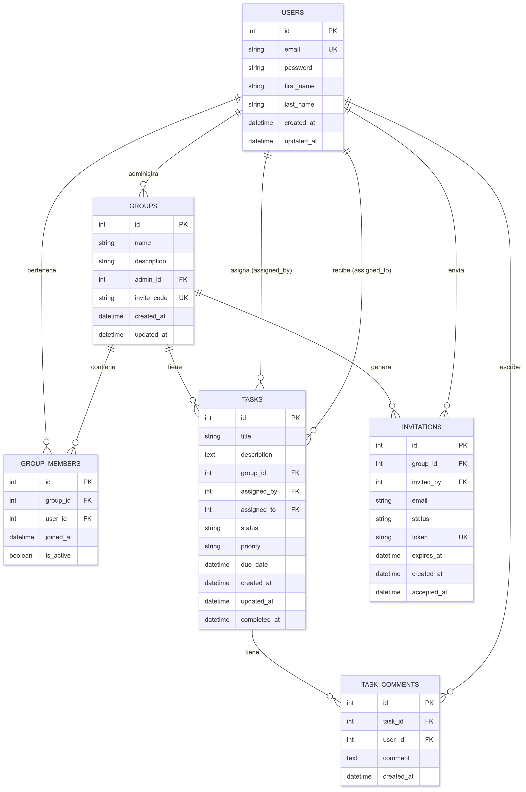

# GetDone – Plataforma Web para Gestión de Tareas

<div align="center">
  

  <p align="center">
    <em>¡Crea Grupos colaborativos y administra Tareas!</em>
  </p>

[](https://nodejs.org/)
[](https://expressjs.com/)
[](https://www.postgresql.org/)
[](https://sequelize.org/)
[](https://developer.mozilla.org/docs/Web/HTML)
[](https://developer.mozilla.org/docs/Web/CSS)
[](https://developer.mozilla.org/docs/Web/JavaScript)
[](https://getbootstrap.com/)

</div>

---

## 📌 Descripción del Proyecto

**GetDone** es una Aplicación web para la gestión colaborativa de tareas y grupos, con frontend y backend desacoplados, que facilita la organización, asignación y seguimiento de actividades en equipo.

---

## 📁 Estructura del Proyecto

```
GetDone/
├── frontend/               # Cliente web (HTML, CSS, JS)
│   ├── assets/             # Imágenes y fuentes
│   ├── css/                # Hojas de estilo
│   ├── js/                 # Scripts principales (admin, user, auth, tasks, etc.)
│   └── views/              # Vistas HTML (admin, user, auth)
├── backend/                # Servidor Node.js/Express
│   ├── config/             # Configuración de Sequelize y BD
│   ├── controllers/        # Lógica de negocio (usuarios, grupos, tareas)
│   ├── models/             # Modelos Sequelize
│   ├── routes/             # Endpoints de la API REST
│   ├── middleware/         # Middlewares (autenticación, etc.)
│   └── app.js              # Entrada principal del backend
├── database/               # Modelos de BD.
├── enunciado_proyecto/     # Documentación adicional
└── README.md               # Este archivo
```

---

## 🚀 Tecnologías principales

- **Backend:** Node.js, Express.js, Sequelize, PostgreSQL, dotenv
- **Frontend:** HTML, CSS, JavaScript

---

## ⚙️ Instrucciones para desarrollo local

### 1. Clona el repositorio

```bash
git clone https://github.com/TOB1EH/GetDone.git
cd GetDone/
```

### 2. Configura el backend

Por convención: Todos los comandos `npm` deben ejecutarse dentro de la carpeta /backend. Debido a que el proyecto se desarrollo con una arquitectura separada frontend/backend, por lo cual se tiene un unico archivo `package.json` alojado en el backend con todas sus dependencias. El frontend no usa Node/npm o herramientas del tipo.

1. Entra a la carpeta:
    ```bash
    cd backend/
    ```
2. Instala las dependencias:
    ```bash
    npm install
    ```
3. Crea un archivo `.env` con la siguiente estructura:
    ```env
    DB_NAME=nombre_de_tu_db
    DB_USER=usuario
    DB_PASS=contraseña
    DB_HOST=localhost
    PORT=3000

    JWT_SECRET=tu_clave_secreta
    ```
    Puedes crear un token aleatorio para usar como clave con el siguiente comando desde la Terminal de Linux:
    ```bash
    head -c 32 /dev/urandom | base64
    ```

4. Configura la base de datos:

    **Sin migraciones:**  
    Asegúrate de tener PostgreSQL corriendo y una base de datos creada.
    Asegúrate de que `sequelize.sync()` esté activado en el código. Nosostros lo configuramos dentro del archivo `app.js` en el backend. Asi que para crear las tablas de la BD automaticamente en caso que no existan es suficiente con iniciar el servidor backend.

    **La Base de datos debera tener la siguiente estructura:**
    

    <!-- - **Con migraciones:**  
      ```bash
      npx sequelize-cli db:migrate
      ``` -->

5. Inicia el servidor backend:
    ```bash
    npm start
    ```
    El backend estará disponible en [http://localhost:3000](http://localhost:3000).

6. Abrir la app:

    Abrir la siguiente direccion: [http://localhost:3000](http://localhost:3000).

---

### 3. Configura el frontend

1. Entra a la carpeta:
    ```bash
    cd ../frontend
    ```
2. Abre `index.html` en tu navegador o usa una extensión tipo "Live Server" para desarrollo.

---

## 📦 Requisitos previos

- Node.js y npm instalados: [Descargar Node.js](https://nodejs.org/)
- PostgreSQL instalado y en funcionamiento
- Configuración correcta del archivo `.env` en `/backend`

---

## 📚 Documentación y arquitectura

- **Endpoints principales:** `/backend/routes/`
- **Lógica de negocio y modelos:** `/backend/controllers/` y `/backend/models/`
- **Frontend:** `/frontend/js/` y `/frontend/views/`
- **El frontend consume la API REST del backend usando fetch y JWT para autenticación.**

---

## 📬 Contacto

Para dudas técnicas o errores de configuración, puedes contactar:
- Tobias Funes: tobiasfunes@hotmail.com.ar - Desarrollador
- Agustin Brambilla: agusbram@gmail.com - Desarrollador

---

¡Proyecto en Desarrollo! 💻